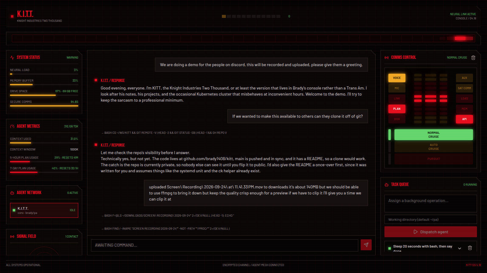

# KITT

A K.I.T.T.-styled web console for [Claude Code](https://code.claude.com). It puts a persistent Claude Code session behind a dashboard on your LAN, runs background tasks as their own sessions, and lets you message the interactive `claude` terminals you already have open.



Everything runs on the machine where Claude Code is installed and logged in. Nothing leaves your network, and it uses your existing Claude subscription, no API key.

## What it does

- **Talk to KITT.** The center panel is a real Claude Code session, started in a directory of your choosing so it inherits that project's `CLAUDE.md`, memory, plugins and MCP servers. Replies stream in, tool calls show as one-line entries, and replies are read aloud as they arrive. The session survives page reloads and hub restarts.
- **Dispatch background tasks.** Each task is a one-shot Claude Code session in a directory you pick. Up to three run at once; the rest queue.
- **Reach your terminals.** Any interactive `claude` session launched through the `ck` wrapper appears on the radar and in the Agent network panel. Pick it and your messages are pushed into that terminal; its replies come back to the console.
- **See the machine.** System status shows real CPU load, memory, drive space and the last API round-trip. Agent metrics shows the session's context usage and your plan's five-hour and seven-day windows, straight from the rate-limit events Claude Code emits.
- **Voice.** Browser speech recognition in. Out, either an optional local text-to-speech sidecar (Kokoro, runs on CPU, sounds the part) or the browser's own voices. Replies are read as they arrive, chunked at tool calls.

## How it fits together

```
kitt/
  hub/       Bun server. Owns the sessions (Claude Agent SDK), the registry, SQLite
             history, one WebSocket protocol to browsers, and serves web/dist.
  channel/   A Claude Code "channel" MCP server (the spoke). Claude Code spawns it
             inside interactive sessions; it dials the hub and relays messages.
  web/       Vite + React console. Pure client; everything it shows comes over the socket.
  tts/       Optional Python sidecar: Kokoro text-to-speech on loopback, proxied by the hub.
```

The hub drives the KITT session and task sessions directly through the [Claude Agent SDK](https://code.claude.com/docs/en/agent-sdk). Interactive terminals are reached through [channels](https://code.claude.com/docs/en/channels), Claude Code's mechanism for pushing events into a running session, which is what the Discord and Telegram plugins use.

## Requirements

- [Bun](https://bun.sh) 1.3 or newer
- Claude Code 2.1.282 or newer, installed and logged in on the same machine
- Python 3.10+ only if you want the voice sidecar
- A browser on the same LAN (Chrome for voice input)

## Install

```sh
git clone https://github.com/brady1408/kitt.git ~/ws/kitt
cd ~/ws/kitt
bun install
bun run web:build
bun run hub
```

Open `http://<this-machine's-ip>:7331`. The KITT session starts in your home directory by default; point it at a project with `KITT_WORKDIR` so it picks up that project's `CLAUDE.md`, and tell it your name with `KITT_OPERATOR`.

### Run it as a service

`deploy/kitt-hub.service` is a systemd user unit that assumes the repo at `~/ws/kitt` and Bun at `~/.bun/bin/bun`; adjust if yours differ, then:

```sh
ln -s ~/ws/kitt/deploy/kitt-hub.service ~/.config/systemd/user/
systemctl --user daemon-reload
systemctl --user enable --now kitt-hub
loginctl enable-linger $USER      # keep it running when you log out
```

### Give KITT a voice (optional)

Browser voices are serviceable; the sidecar is much better. It runs [Kokoro](https://github.com/thewh1teagle/kokoro-onnx) on the CPU, loopback only, and the hub proxies it at `/tts`. Needs Python 3.10+ and about 400 MB for the model.

```sh
cd ~/ws/kitt/tts
python3 -m venv .venv && .venv/bin/pip install -r requirements.txt     # or: uv venv .venv && uv pip install --python .venv/bin/python -r requirements.txt
curl -L -o models/kokoro-v1.0.onnx https://github.com/thewh1teagle/kokoro-onnx/releases/download/model-files-v1.0/kokoro-v1.0.onnx
curl -L -o models/voices-v1.0.bin   https://github.com/thewh1teagle/kokoro-onnx/releases/download/model-files-v1.0/voices-v1.0.bin
.venv/bin/python server.py           # or install deploy/kitt-tts.service the same way as the hub unit
.venv/bin/python smoke.py            # synthesizes one sentence and checks it
```

With the sidecar up, the Voice picker in Comms control lists its voices first; `am_michael` is the default and the closest to the character. Without it, the console falls back to the browser voice automatically.

### Attach your terminals

Register the spoke once as a user-scope MCP server, then launch terminals you want in the console with `ck` instead of `claude`:

```sh
claude mcp add --scope user kitt -- bun run ~/ws/kitt/channel/server.ts
ln -s ~/ws/kitt/scripts/ck ~/.local/bin/ck
ck                     # any claude arguments pass through, e.g. ck --resume <id>
```

`ck` sets `KITT_CHANNEL=1` and passes `--dangerously-load-development-channels server:kitt`. Channels are a research-preview feature, so Claude Code asks you to confirm once per launch. Plain `claude` sessions also spawn the spoke, since it is a user-scope server, but it stays inert there: no tools, no registration.

## Using the console

**Send modes.** The three plates under the voice matrix decide where what you type goes:

| Plate | Goes to |
|---|---|
| `NORMAL CRUISE` | The KITT session |
| `AUTO CRUISE` | A new background task, in the directory set in the Task queue panel |
| `PURSUIT` | The selected terminal. Clicking a terminal on the radar, in Agent network, or in the activity log selects it and switches to this mode |

**Lamps.** `VOICE` and `MIC` are controls. `LINK`, `PLAN`, `DISK`, `LOAD`, `MEM` and `API` light red as alarms. `AUX` and `SAT COMM` light yellow with a count while tasks are running or terminals are online.

**Header bar.** One LED segment per session: dim when idle, bright and pulsing while working, red on error, grey when the hub link is lost.

**Signal field.** A radar of live sessions over a log of recent activity: tool calls, task and terminal state changes, plan and disk thresholds, link changes.

The trash icon in the Comms control title clears the KITT conversation and starts a fresh session.

## Configuration

Hub environment variables:

| Variable | Default | Purpose |
|---|---|---|
| `KITT_PORT` | `7331` | Listen port |
| `KITT_HOST` | `0.0.0.0` | Bind address |
| `KITT_DATA_DIR` | `~/.local/share/kitt` | SQLite database location |
| `KITT_WORKDIR` | your home directory | Working directory of the KITT session and default for tasks |
| `KITT_OPERATOR` | your username | How KITT addresses you |

| `KITT_TTS_URL` | `http://127.0.0.1:7333` | Where the text-to-speech sidecar listens |

Sidecar environment variables: `KITT_TTS_PORT` (7333), `KITT_TTS_HOST` (127.0.0.1), `KITT_TTS_VOICE` (`am_michael`), `KITT_TTS_MODEL` and `KITT_TTS_VOICES` (model file paths).

Spoke environment variables: `KITT_HUB_URL` (default `ws://127.0.0.1:7331/spoke`) and `KITT_CHANNEL` (set to `1` by `ck`).

The KITT persona and the task prompt live in `hub/src/persona.ts` if you want a different character.

## Security

This is built for a trusted LAN and nothing more.

- There is no authentication. Anyone who can reach the port can talk to KITT and dispatch tasks.
- The KITT and task sessions run with Claude Code permissions bypassed. They can do anything your shell can.
- The browser socket refuses cross-origin upgrades, so a web page you visit elsewhere cannot drive the hub. Spokes are accepted from loopback only.
- Task working directories must be inside your home directory.

Do not expose the port to the internet.

## Development

```sh
bun run hub          # hub on :7331, serving web/dist
bun run web:dev      # Vite on :5173 with /ws proxied to the hub, for UI work
bun test             # hub, channel and web tests
bun run typecheck    # all three packages
```

The console design was started in [Lovable](https://lovable.dev) and ported by hand; the design sandbox lives in a separate repository. The hub-to-browser protocol is defined once in `hub/src/protocol.ts` and imported by the web package.

## Status

v1. Working and in daily use on one Linux machine; other platforms are untested. Known rough edges: the `API` lamp trips on long tool-heavy turns. Issues and pull requests are welcome.
